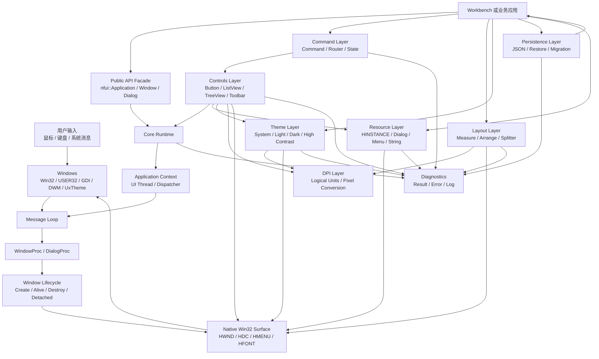
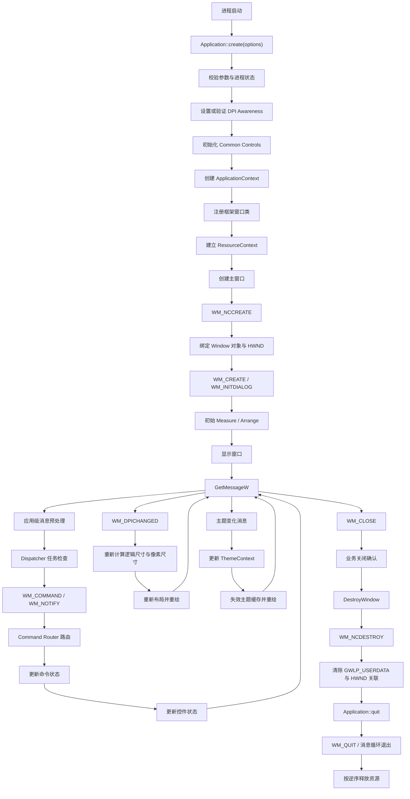
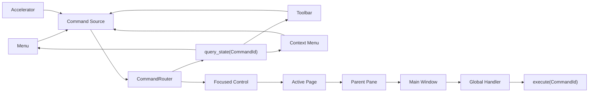
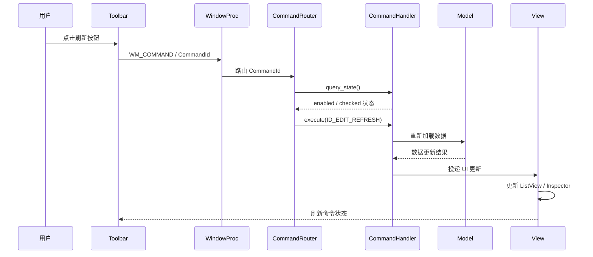

# Original System Architecture Baseline

<!-- markdownlint-disable -->

可以。建议把这张图作为整个项目的**架构基准图**，放入：

```text
docs/architecture/system-architecture.md
```

它不只是模块关系图，还应明确依赖方向、运行时流程、设计模式和不可违反的工程规则。

# NativeFrame UI 总体架构基准

## 1. 架构定位

NativeFrame UI 采用：

```text
分层架构
+ 端口与适配器思想
+ 事件驱动模型
+ 组合优先
+ RAII 生命周期管理
+ 显式状态机
```

核心目标是：

- 上层业务不直接承担 Win32 生命周期细节。
- Core 不知道具体业务、主题、布局和控件语义。
- 具体控件不反向依赖业务命令。
- 纯逻辑模块可以脱离真实窗口进行测试。
- 原生 `HWND` 始终可访问，不封闭底层能力。
- 所有资源、句柄、线程和回调都有明确的所有权边界。

## 2. 总体架构流程图



## 3. 运行时主流程图



## 4. 模块依赖规则

模块依赖必须保持单向：

```text
Public API
    ↓
Application / Window / Dialog
    ↓
Core Services
    ↓
Win32 Adapters
```

完整依赖约束：

```text
core        → Win32 基础 API
resource    → core、Win32 资源 API
dpi         → core、Win32 DPI API
theme       → core、dpi、UxTheme、DWM
layout      → core、dpi
controls    → core、resource、theme、dpi、layout
command     → core
persistence → core、文件系统、JSON 编解码
sample      → 所有公共模块
```

严格禁止：

```text
core        → controls
core        → command
layout      →具体控件实现
command     → Menu / Toolbar / TreeView
persistence → HWND / Window 对象
theme       → 业务模块
resource    → 业务模块
```

依赖方向的基准原则：

> 越靠近 Core 的模块，越稳定、越通用、越少了解上层语义。

## 5. 设计模式映射

### 5.1 Facade：公共 API 门面

对外公开的入口：

```cpp
nfui::Application
nfui::Window
nfui::Dialog
nfui::Control
```

Facade 隐藏：

- WindowProc 绑定
- Common Controls 初始化
- DPI 设置
- 资源模块解析
- 线程上下文
- 句柄状态维护

但 Facade 必须保留必要的原生访问能力：

```cpp
HWND hwnd() const noexcept;
```

原则：

> 封装生命周期和通用行为，不封闭 Win32 能力。

### 5.2 RAII：资源和句柄生命周期

适用对象：

```text
ApplicationContext
WindowClassRegistration
Owned Window
HICON / HCURSOR
HFONT
HBRUSH
HPEN
HDC
文件句柄
配置写入临时文件
```

不适合直接用 RAII 销毁的对象：

```text
Borrowed HWND
父窗口拥有的子控件 HWND
外部传入的 HINSTANCE
外部传入的 HMENU
```

所有权必须在类型或 API 名称中表达：

```cpp
create()             // 创建并拥有
attach_borrowed()    // 借用
detach()             // 放弃管理权
```

原则：

> 谁创建，谁负责释放；谁借用，谁不能销毁。

### 5.3 State：窗口和应用状态机

Application 状态：

```text
Empty
  ↓
Initializing
  ↓
Initialized
  ↓
Running
  ↓
Stopping
  ↓
Stopped
```

Window 状态：

```text
Detached
  ↓
Creating
  ↓
Alive
  ↓
Destroying
  ↓
Detached
```

状态检查必须位于公共操作边界：

```cpp
if (state_ != ApplicationState::Initialized) {
    return unexpected(ErrorCode::InvalidState);
}
```

原则：

> 状态转换必须显式，非法状态操作必须可诊断，不能依赖偶然的 Win32 行为。

### 5.4 Adapter：Win32 适配层

Win32 Adapter 负责把系统 API 转换成框架内部语义：

```text
Win32 API
    ↓
Win32 Adapter
    ↓
Core / Theme / DPI / Resource
```

适配内容包括：

- `GetLastError` 转 `Error`
- `HWND` 生命周期转换
- DPI API 能力检测
- `HINSTANCE` 资源查找
- UxTheme 和 DWM 兼容调用
- `GetMessageW` 和 `DispatchMessageW`

Adapter 不承载业务逻辑。

原则：

> 平台差异集中处理，业务层不散落版本判断和 Win32 错误转换。

### 5.5 Command：命令模式

菜单、Toolbar、快捷键和上下文菜单都只产生：

```cpp
CommandId
```

然后交给：

```text
CommandSource
    ↓
CommandRouter
    ↓
CommandHandler
    ↓
CommandState
```

流程：



原则：

> 控件只发布命令意图，不负责决定业务行为。

### 5.6 Mediator：消息和命令路由

窗口之间不直接互相持有复杂引用。跨区域通信优先通过：

```text
事件
命令
Dispatcher
父级协调器
```

例如：

```text
TreeView selection changed
    ↓
Workbench Coordinator
    ↓
更新 ListView 数据
    ↓
更新 Inspector
```

而不是：

```text
TreeView 直接持有 ListView 和 Inspector 指针
```

原则：

> 让父级协调器承担跨组件协作，减少控件之间的双向耦合。

### 5.7 Strategy：主题、布局和持久化策略

主题：

```cpp
ThemeMode::System
ThemeMode::Light
ThemeMode::Dark
```

布局：

```text
AnchorLayout
LinearLayout
SplitterLayout
```

持久化：

```text
JsonPersistence
MemoryPersistence
Future: RegistryPersistence
```

上层依赖策略接口，不依赖具体实现：

```cpp
class PersistenceBackend {
public:
    virtual Result<UiState> load() = 0;
    virtual Result<void> save(const UiState&) = 0;
};
```

原则：

> 变化频繁的策略应通过稳定接口隔离；不为只有一个实现且没有变化迹象的代码提前抽象。

### 5.8 Observer：主题、窗口和状态变化

适合使用观察者机制的事件：

```text
主题变化
系统 DPI 变化
窗口尺寸变化
选择变化
命令状态变化
```

但观察者必须有明确注销时机。推荐使用连接令牌：

```cpp
class Subscription {
public:
    Subscription() noexcept = default;
    ~Subscription();

    Subscription(const Subscription&) = delete;
    Subscription& operator=(const Subscription&) = delete;
};
```

规则：

- 订阅对象销毁时自动解除订阅。
- 被观察对象不保存裸指针作为长期监听者。
- 通知期间不持有内部锁。
- 回调异常不能传播到 Win32 消息边界。
- 销毁中的对象不得再收到异步通知。

### 5.9 Factory：窗口和控件创建

Factory 只负责创建和绑定，不负责业务配置：

```text
WindowFactory
ControlFactory
DialogFactory
ResourceFactory
```

创建流程：

```text
Factory
    ↓
参数校验
    ↓
资源或窗口类解析
    ↓
Win32 创建
    ↓
对象绑定
    ↓
返回拥有型对象或 Result
```

不建议使用基于字符串的大型万能工厂：

```cpp
create("TreeView", ...)
```

优先使用类型化或明确的创建函数：

```cpp
TreeView::create(...)
ListView::create(...)
```

## 6. 核心架构原则

以下规则作为项目基准，代码评审时必须遵守。

### 规则 R1：依赖单向

上层可以依赖下层，下层不能反向依赖上层。

### 规则 R2：对象地址稳定

窗口绑定到 `HWND` 后，包装对象地址必须保持稳定，直到 `WM_NCDESTROY` 完成。

因此：

```text
Window 不可复制
Window 不可移动
Window 推荐通过 unique_ptr 管理
```

### 规则 R3：句柄所有权显式

任何 `HWND`、`HDC`、`HBRUSH`、`HFONT`、`HMENU` 都必须明确：

```text
Owned
Borrowed
Shared
```

没有明确所有权的句柄不得进入公共接口。

### 规则 R4：回调边界不抛异常

以下边界必须是 `noexcept` 语义：

```text
WindowProc
DialogProc
WndProc 注册回调
Dispatcher 消息回调
日志回调边界
系统事件回调
```

异常只能在边界内部捕获并转成：

```text
Error
日志
默认 Win32 行为
```

### 规则 R5：UI 线程唯一操作窗口

非 UI 线程禁止直接调用：

```text
CreateWindow
DestroyWindow
SetWindowText
SetWindowPos
InvalidateRect
主题切换
布局更新
```

后台线程只能通过：

```cpp
dispatcher.post(...)
```

投递任务。

### 规则 R6：不在锁内回调

禁止：

```cpp
lock();
user_callback();
unlock();
```

必须：

```text
锁内复制状态或回调列表
释放锁
执行用户回调
```

### 规则 R7：不在析构函数中执行不可控业务逻辑

析构函数可以：

- 释放明确拥有的句柄
- 取消订阅
- 清空内部队列
- 解除窗口绑定

析构函数不应：

- 调用业务回调
- 等待后台线程无限结束
- 触发复杂命令
- 发送不确定会重入的同步消息

### 规则 R8：逻辑单位和像素单位分离

```text
Layout / Persistence：逻辑单位或比例
Win32 SetWindowPos：设备像素
```

禁止让 `RECT` 在不同模块之间无说明地传递。

推荐使用类型：

```cpp
LogicalSize
PixelSize
LogicalRect
PixelRect
```

### 规则 R9：公共 API 不泄露平台实现细节，但保留原生句柄

公共 API 可以暴露：

```cpp
HWND hwnd() const noexcept;
```

不应暴露：

```text
WindowImpl
ThreadContextImpl
内部消息窗口 HWND
主题缓存结构
内部资源缓存
内部 JSON 节点类型
```

### 规则 R10：默认失败可恢复

以下错误不能直接导致进程退出：

```text
配置文件损坏
可选资源缺失
系统主题 API 不可用
非关键图标加载失败
未知 JSON 字段
窗口恢复位置无效
```

以下错误可以阻止初始化：

```text
主模块实例为空
核心窗口类注册失败
主窗口创建失败
关键系统 API 不可用且没有回退
```

### 规则 R11：平台兼容性集中处理

禁止在业务代码中大量出现：

```cpp
if (IsWindows10())
if (IsWindows11())
GetProcAddress(...)
GetLastError()
```

这些逻辑应集中在：

```text
platform/
win32_adapter/
dpi/
theme/
```

### 规则 R12：先组合，后继承

继承仅用于稳定的框架扩展点：

```text
Window
Dialog
CommandHandler
LayoutNode
```

业务组合优先使用：

```text
Window + CommandRouter + Layout + Controls + ThemeContext
```

不为每个业务窗口创建一条深层继承树。

## 7. 禁止的架构模式

以下做法不应进入 V1：

```text
全局 HWND 单例
全局 ThemeManager 单例
全局 CommandManager 单例
窗口之间互相持有裸指针
在窗口过程中直接 delete this
在非 UI 线程操作 HWND
用字符串反射创建所有控件
用异常跨越 Win32 回调
用 GetModuleHandle(nullptr) 固定加载所有资源
用裸 int 混用 DPI 逻辑尺寸和像素尺寸
用空闲循环持续刷新全部命令状态
将业务状态写进 Window 类基类
Core 直接依赖具体控件
```

特别是全局单例，需要避免。虽然主题、命令和资源上下文看起来适合做全局对象，但它们会造成：

- 测试之间互相污染
- 初始化顺序不明确
- 多窗口生命周期难以管理
- 退出阶段出现悬空引用
- 未来多实例或多 UI 线程扩展困难

推荐通过 `ApplicationContext` 显式持有服务：

```cpp
class ApplicationContext {
public:
    ResourceService& resources() noexcept;
    ThemeService& themes() noexcept;
    Dispatcher& dispatcher() noexcept;
    Diagnostics& diagnostics() noexcept;
};
```

## 8. 一次用户操作的完整链路

以点击 Toolbar 的“刷新”命令为例：



这里体现的设计规则是：

```text
Toolbar 不知道业务模型
WindowProc 不执行业务逻辑
CommandRouter 不知道具体控件
Model 不直接操作 HWND
View 更新只能发生在 UI 线程
```

## 9. 设计评审基准

每个新模块加入前，必须回答：

```text
1. 它属于哪一层？
2. 它依赖哪些下层模块？
3. 谁拥有它管理的资源？
4. 它运行在哪个线程？
5. 它的状态如何转换？
6. 它如何报告错误？
7. 它是否会触发用户回调？
8. 回调期间是否可能重入？
9. 它能否脱离 Win32 进行测试？
10. 它是否会把具体实现细节泄露到公共 API？
```

如果一个设计不能明确回答这些问题，就不应直接进入实现。

## 10. 推荐冻结结论

作为详细设计的架构基线，建议冻结为：

```text
架构：分层 + 端口/适配器 + 事件驱动
公共入口：Facade
生命周期：RAII + 显式状态机
窗口绑定：稳定对象地址 + GWLP_USERDATA
命令：Command + Mediator
主题/布局/持久化：Strategy
变化通知：Observer + Subscription
创建：Factory
平台隔离：Win32 Adapter
线程模型：单进程单 UI 线程
错误模型：Result/Error
回调边界：noexcept，不跨边界抛异常
窗口对象：不可复制、不可移动
句柄管理：Owned/Borrowed 明确区分
UI 更新：只能在 UI 线程
资源加载：显式 ResourceContext
DPI：逻辑单位与像素单位严格分离
测试：纯逻辑单元测试 + 隐藏窗口集成测试 + 人工 UI 验证
```

这张架构图和规则集可以作为后续 Core、Controls、Layout、Theme、Command 和 Persistence 详细设计的共同基线。任何模块如果需要违反这些规则，应先通过 ADR 记录原因、影响范围、替代方案和测试要求。

